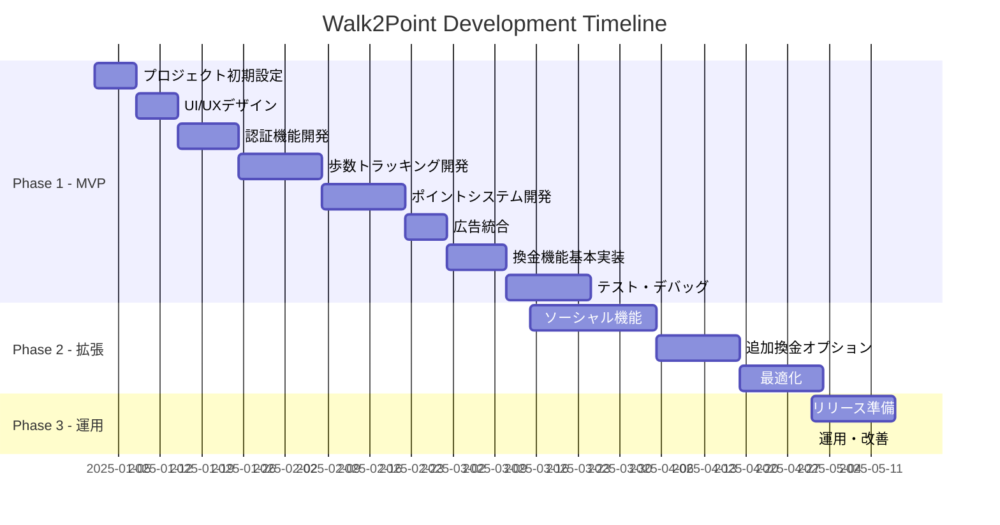

# Walk2Point - 開発ロードマップ

## プロジェクトタイムライン概要

## Phase 1: MVP開発（2025年1月〜3月）

### Sprint 1: プロジェクト基盤構築（Week 1-2）

#### Week 1: 環境構築とプロジェクト設定
- [ ] Expoプロジェクト初期化
- [ ] TypeScript設定
- [ ] ESLint/Prettier設定
- [ ] Git リポジトリ設定
- [ ] CI/CD基本設定
- [ ] プロジェクト構造の作成

**成果物:**
- 開発環境構築完了
- プロジェクトテンプレート

#### Week 2: UI/UXデザインとプロトタイプ
- [ ] ワイヤーフレーム作成
- [ ] デザインシステム定義
- [ ] UIコンポーネントライブラリ選定
- [ ] 画面遷移図作成
- [ ] プロトタイプ作成（Figma）

**成果物:**
- デザインガイドライン
- 画面モックアップ
- インタラクティブプロトタイプ

### Sprint 2: 認証機能実装（Week 3-4）

#### Week 3: Firebase設定と認証基盤
- [ ] Firebase プロジェクト作成
- [ ] Authentication設定
- [ ] Firestore設定
- [ ] セキュリティルール定義
- [ ] 認証フロー実装（登録/ログイン）

#### Week 4: 認証UI実装とテスト
- [ ] ログイン画面実装
- [ ] 新規登録画面実装
- [ ] パスワードリセット機能
- [ ] 認証状態管理（Redux/Context）
- [ ] 単体テスト作成

**成果物:**
- 完全動作する認証システム
- セキュアなユーザー管理

### Sprint 3: 歩数トラッキング機能（Week 5-7）

#### Week 5: HealthKit連携
- [ ] HealthKit権限リクエスト実装
- [ ] 歩数データ取得機能
- [ ] バックグラウンド更新設定
- [ ] データ同期ロジック

#### Week 6: 歩数表示UI
- [ ] ダッシュボード画面実装
- [ ] 今日の歩数表示
- [ ] 週間グラフ表示
- [ ] アニメーション実装

#### Week 7: データ永続化とテスト
- [ ] Firestore連携
- [ ] オフライン対応
- [ ] 同期エラーハンドリング
- [ ] 統合テスト

**成果物:**
- HealthKit完全統合
- リアルタイム歩数追跡
- データ可視化

### Sprint 4: ポイントシステム（Week 8-10）

#### Week 8: ポイント計算ロジック
- [ ] ポイント換算アルゴリズム
- [ ] 日次上限チェック
- [ ] ポイント付与API実装
- [ ] トランザクション記録

#### Week 9: ポイント管理画面
- [ ] ポイント残高表示
- [ ] 獲得履歴一覧
- [ ] フィルター機能
- [ ] 詳細画面

#### Week 10: ポイント検証
- [ ] 不正検知システム
- [ ] レート制限実装
- [ ] ポイント整合性チェック
- [ ] 負荷テスト

**成果物:**
- 完全なポイントシステム
- 不正対策実装済み

### Sprint 5: 広告統合と換金機能（Week 11-13）

#### Week 11: AdMob統合
- [ ] AdMob SDK設定
- [ ] バナー広告実装
- [ ] リワード動画広告実装
- [ ] 広告表示最適化

#### Week 12: 換金機能基本実装
- [ ] 換金オプション画面
- [ ] 申請フォーム実装
- [ ] バリデーション
- [ ] 確認画面

#### Week 13: 換金処理とテスト
- [ ] 換金API実装
- [ ] ステータス管理
- [ ] 通知機能
- [ ] E2Eテスト

**成果物:**
- 広告収益化実装
- 基本的な換金フロー

### Sprint 6: テストとリリース準備（Week 14-15）

#### Week 14: 品質保証
- [ ] 全機能統合テスト
- [ ] パフォーマンステスト
- [ ] セキュリティ監査
- [ ] バグ修正

#### Week 15: リリース準備
- [ ] App Store Connect設定
- [ ] アプリ説明文作成
- [ ] スクリーンショット準備
- [ ] TestFlightベータ版配信

**成果物:**
- リリース可能なMVP
- ベータテスト開始

## Phase 2: 機能拡張（2025年3月〜4月）

### Sprint 7-8: ソーシャル機能（3週間）

#### 実装項目:
- [ ] 友達招待システム
- [ ] ユーザーランキング
- [ ] アチーブメント機能
- [ ] ソーシャルシェア
- [ ] プッシュ通知

**期待成果:**
- ユーザーエンゲージメント向上
- バイラル成長の基盤

### Sprint 9: 追加換金オプション（2週間）

#### 実装項目:
- [ ] PayPay連携
- [ ] 楽天ポイント連携
- [ ] 各種ギフトカード対応
- [ ] 換金プロセス自動化

**期待成果:**
- 換金オプション多様化
- ユーザー満足度向上

### Sprint 10: 最適化（2週間）

#### 実装項目:
- [ ] パフォーマンス最適化
- [ ] バンドルサイズ削減
- [ ] 起動時間短縮
- [ ] バッテリー消費最適化
- [ ] A/Bテスト実装

**期待成果:**
- アプリ品質向上
- ユーザー体験改善

## Phase 3: リリースと運用（2025年5月〜）

### リリース準備（2週間）

#### Week 1: 最終準備
- [ ] プロダクション環境構築
- [ ] 本番データ移行
- [ ] 負荷テスト実施
- [ ] ドキュメント整備

#### Week 2: App Store申請
- [ ] 審査ガイドライン確認
- [ ] アプリ申請
- [ ] マーケティング準備
- [ ] サポート体制構築

### 継続的運用

#### 日次タスク:
- モニタリング確認
- ユーザーサポート対応
- 広告最適化

#### 週次タスク:
- KPI分析
- ユーザーフィードバック分析
- 改善案検討

#### 月次タスク:
- 機能アップデート
- A/Bテスト結果分析
- 収益最適化

## マイルストーン

| 日付 | マイルストーン | 詳細 |
|------|--------------|------|
| 2025/01/31 | Alpha版完成 | 基本機能実装完了 |
| 2025/02/28 | Beta版完成 | 全主要機能実装 |
| 2025/03/15 | TestFlight公開 | クローズドベータ開始 |
| 2025/04/15 | RC版完成 | リリース候補版 |
| 2025/05/01 | v1.0リリース | App Store公開 |
| 2025/06/01 | v1.1リリース | 初回アップデート |

## リスク管理

### 技術的リスク
| リスク | 影響度 | 対策 |
|--------|--------|------|
| HealthKit APIの制限 | 高 | 代替データソース検討 |
| 広告収益の不足 | 高 | 複数広告ネットワーク対応 |
| アプリ審査リジェクト | 中 | ガイドライン準拠確認 |
| パフォーマンス問題 | 中 | 早期最適化実施 |

### ビジネスリスク
| リスク | 影響度 | 対策 |
|--------|--------|------|
| ユーザー獲得コスト | 高 | オーガニック成長重視 |
| 競合アプリの出現 | 中 | 差別化機能開発 |
| 法規制変更 | 低 | 定期的な法務確認 |

## 成功指標（KPI）

### リリース3ヶ月目標
- **DAU**: 1,000人
- **MAU**: 5,000人
- **7日間継続率**: 40%
- **月間広告収益**: 50万円
- **ARPU**: 100円

### リリース6ヶ月目標
- **DAU**: 5,000人
- **MAU**: 20,000人
- **7日間継続率**: 50%
- **月間広告収益**: 250万円
- **ARPU**: 125円

## チーム構成案

### 最小構成（MVP開発）
- プロジェクトマネージャー: 1名
- iOSエンジニア: 1名
- バックエンドエンジニア: 1名（兼任可）
- UI/UXデザイナー: 1名（パートタイム）

### 理想構成（スケール時）
- プロジェクトマネージャー: 1名
- iOSエンジニア: 2名
- バックエンドエンジニア: 1名
- UI/UXデザイナー: 1名
- QAエンジニア: 1名
- マーケター: 1名

## 予算概算

### 開発費用（3ヶ月）
- 人件費: 300-500万円
- インフラ費: 月5万円
- ツール・サービス: 月3万円
- マーケティング: 50万円
- **合計**: 400-650万円

### 運用費用（月額）
- インフラ: 5-10万円
- 広告配信: 収益の20%
- ポイント還元: 収益の60%
- 運用人件費: 50万円
- **合計**: 収益の80% + 55-60万円

## 次のアクション

1. **技術検証（1週間）**
   - Expo + HealthKit動作確認
   - AdMob統合テスト
   - Firebase料金シミュレーション

2. **チーム編成（2週間）**
   - 開発メンバー確保
   - 役割分担決定
   - 開発環境準備

3. **MVP開発開始**
   - Sprint 1からスタート
   - 2週間スプリントで進行
   - 定期的なレビュー実施

---
*Document Version: 1.0*
*Last Updated: 2025-09-25*